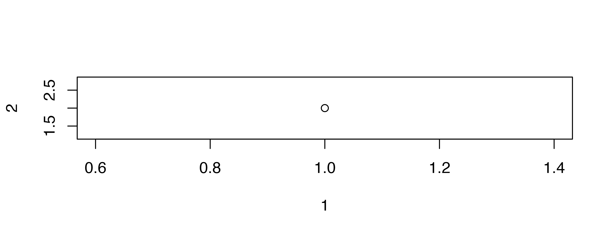

::: {.content-visible when-meta="list-of-figures-normal"}


```{=latex}
\listoftables
\listoffigures
```


:::

::: {.content-visible when-meta="list-of-figures-single"}


```{=latex}
\begin{singlespace}
\listoftables
\listoffigures
\end{singlespace}
```


:::

\clearpage

# A

Aaaaaaaaaaaaaaa

## B

BBbbbbb


::: {.cell layout-align="center"}
::: {.cell-output-display}
{#fig-label fig-align='center' width=100%}
:::
:::


\clearpage

# References
