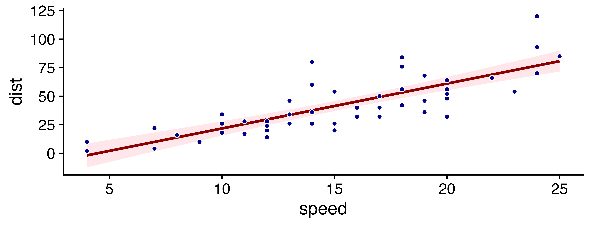

# Introduction



# Material and Methods



# Discussion



Blah. 
See @fig-label for a test.

::: {.cell layout-align="center"}
::: {.cell-output-display}
{#fig-label fig-align='center' width=100%}
:::
:::

# Conclusion



# References

